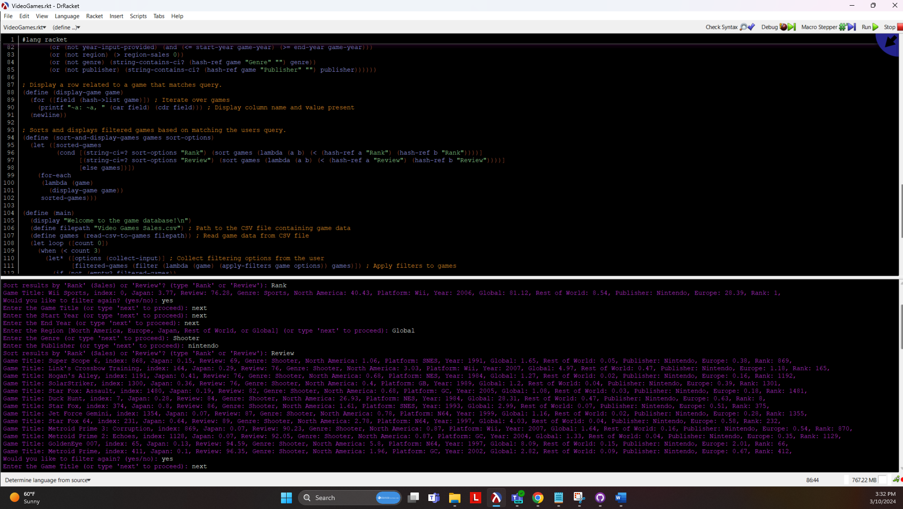

# CS-353 VideoGameDatabase
 Simulate a video game database where a user is allowed to query the system and we display the results to the user. 

### References: 
- [Sort by elements in a list in Racket](https://stackoverflow.com/questions/64799044/sort-by-elements-in-a-list-in-racket)
- [How to filter lists in a list in Scheme](https://stackoverflow.com/questions/57813823/how-to-filter-lists-in-a-list-in-scheme)
- [How to download and parse a csv file in Racket](https://stackoverflow.com/questions/10883426/how-to-download-and-parse-a-csv-file-in-racket)
 

### To Do:
- Adjust the "region" filter to only display the selected region. This would create a better UX (even for me)
- Better input validation

#### Single query and result
##### Inputs
- Title: Wii Sports
- Start Year: 2005
- End Year: 2007
- Region: next
- Genre: next
- Publisher: Nintendo
- Rank/Review: Rank
##### Outputs
- Game Title: Wii Sports, index: 0, Japan: 3.77, Review: 76.28, Genre: Sports, North America: 40.43, Platform: Wii, Year: 2006, Global: 81.12, Rest of World: 8.54, Publisher: Nintendo, Europe: 28.39, Rank: 1,

#### Single query and result
##### Inputs
- Title: next
- Start Year: next
- End Year: next
- Region: Global
- Genre: Shooter
- Publisher: nintendo (case-insensitive matching)
- Rank/Review: Review
##### Outputs
- Sort results by 'Rank' (Sales) or 'Review'? (type 'Rank' or 'Review'): Review
- Game Title: Super Scope 6, index: 868, Japan: 0.15, Review: 69, Genre: Shooter, North America: 1.06, Platform: SNES, Year: 1991, Global: 1.65, Rest of World: 0.05, Publisher: Nintendo, Europe: 0.38, Rank: 869,
- Game Title: Link's Crossbow Training, index: 164, Japan: 0.29, Review: 76, Genre: Shooter, North America: 3.03, Platform: Wii, Year: 2007, Global: 4.97, Rest of World: 0.47, Publisher: Nintendo, Europe: 1.18, Rank: 165,
- Game Title: Hogan's Alley, index: 1191, Japan: 0.41, Review: 76, Genre: Shooter, North America: 0.68, Platform: NES, Year: 1984, Global: 1.27, Rest of World: 0.02, Publisher: Nintendo, Europe: 0.16, Rank: 1192,
- Game Title: SolarStriker, index: 1300, Japan: 0.36, Review: 76, Genre: Shooter, North America: 0.4, Platform: GB, Year: 1989, Global: 1.2, Rest of World: 0.04, Publisher: Nintendo, Europe: 0.39, Rank: 1301, ..., 

#### Single query and result
##### Inputs
- Title: next
- Start Year: 2000
- End Year: 2020
- Region: next
- Genre: Shooter
- Publisher: Microsoft (partial name matching)
- Rank/Review: Rank
##### Outputs
- Sort results by 'Rank' (Sales) or 'Review'? (type 'Rank' or 'Review'): Rank
- Game Title: Kinect Adventures!, index: 17, Japan: 0.24, Review: 65.39, Genre: Misc, North America: 13.5, Platform: X360, Year: 2010, Global: 19.9, Rest of World: 1.82, Publisher: Microsoft Game Studios, Europe: 4.34, Rank: 18,
- Game Title: Halo 3, index: 36, Japan: 0.13, Review: 93.53, Genre: Shooter, North America: 7.72, Platform: X360, Year: 2007, Global: 11.75, Rest of World: 1.18, Publisher: Microsoft Game Studios, Europe: 2.71, Rank: 37,
- Game Title: Halo: Reach, index: 54, Japan: 0.08, Review: 91.79, Genre: Shooter, North America: 6.69, Platform: X360, Year: 2010, Global: 9.4, Rest of World: 0.84, Publisher: Microsoft Game Studios, Europe: 1.79, Rank: 55,
- Game Title: Halo 2, index: 62, Japan: 0.05, Review: 94.57, Genre: Shooter, North America: 6.82, Platform: XB, Year: 2004, Global: 8.49, Rest of World: 0.08, Publisher: Microsoft Game Studios, Europe: 1.53, Rank: 63, ...,

